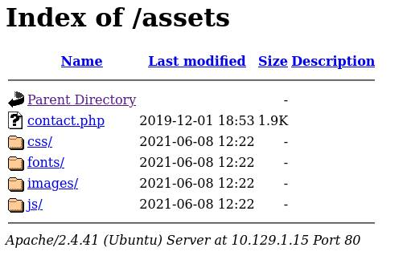
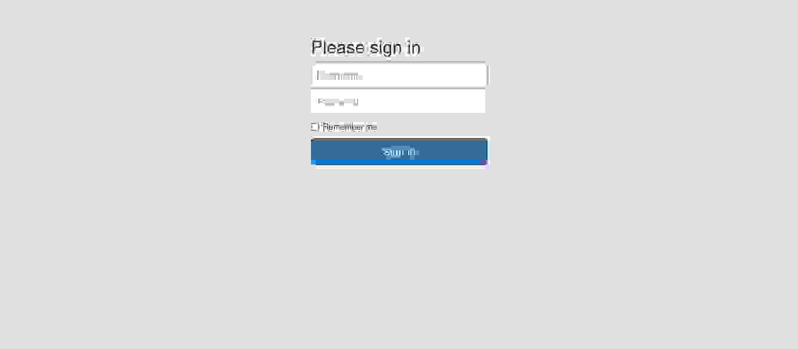

# Hack the Box - Crocodile


---
## * Informações

☐ **Descrição:** Uma maquina com servidor ftp com login anonimo exposto e um servidor http apache

☐ **Ip:** 10.129.1.15

☐ **Serviços:**  FTP e HTTP Apache

---
## ! Vulnerabilidades

| ID | Serviço | Descrição |
|----|------|-----------|
| V-01 | FTP | Servidor FTP exposto na rede com login anônimo habilitado |
|V-02 | HTTP/Apache | Server Apache deixa fazer ataque brute force de busca de diretórios ocultos |

---
## + Enumeração
### =NMAP=

Eu ja sabia que a maquina tinha um serviço FTP e um HTTP, ent eu só escaneei a porta 21 e a 80 pra ser mais rapido.
Usei o comando:

```bash
nmap -sV -sC -p  21-80  10.129.1.15
```
 Resultado:


O parâmetro -sC ja conecta em qualquer servidor FTP que tenha servidor anônimo habilitado!

---
## $ Exploração
### =Servidor FTP=

Agora nós dentro do server, vamos listar o arquivos(Eu sei que isso já foi feito no scan do NMAP, mas quero deixar essa etapa aqui :p )

```bash
ftp> ls
229 Entering Extended Passive Mode (|||42446|)
150 Here comes the directory listing.
-rw-r--r--    1 ftp      ftp            33 Jun 08  2021 allowed.userlist
-rw-r--r--    1 ftp      ftp            62 Apr 20  2021 allowed.userlist.passwd
226 Directory send OK.
```
E agora vamos baixar esses dois arquivos, eu usei o comando **get "nome do arquivo"** e baixei os dois no meu pc

Vamos ver o conteúdo deles usando **cat**


### =Servidor Apache=

O site tinha essa interface principal:


E é ela que vamos explorar

### =Gobuster=

Agora no gobuster, eu usei:

```bash
gobuster dir -u http://10.129.1.15/ -w /usr/share/wordlists/dirb/common.txt -x php  
```

Saída:
```bash
/.htaccess            (Status: 403) [Size: 276]
/.hta.php             (Status: 403) [Size: 276]
/.hta                 (Status: 403) [Size: 276]
/.htaccess.php        (Status: 403) [Size: 276]
/.htpasswd            (Status: 403) [Size: 276]
/.htpasswd.php        (Status: 403) [Size: 276]
/assets               (Status: 301) [Size: 311] [--> http://10.129.1.15/assets/]
/config.php           (Status: 200) [Size: 0]
/css                  (Status: 301) [Size: 308] [--> http://10.129.1.15/css/]
/dashboard            (Status: 301) [Size: 314] [--> http://10.129.1.15/dashboard/]
/fonts                (Status: 301) [Size: 310] [--> http://10.129.1.15/fonts/]
/index.html           (Status: 200) [Size: 58565]
/js                   (Status: 301) [Size: 307] [--> http://10.129.1.15/js/]
/login.php            (Status: 200) [Size: 1577]
/logout.php           (Status: 302) [Size: 0] [--> login.php]
/server-status        (Status: 403) [Size: 276]
```

Descobri varios diretorios, a unicas duas que me interessei foram, login.php e assest

A pagina do assets:


A pagina do login.php:


---
## ^ Escalação de Privilégios
### =login.php=

Usando aquela pagina, eu fui testando as credenciais, e uma delas deram certo, mas isso eu não vou mostrar pois pode dar respostas da maquina

Agora na pagina de root a flag já é encontrada:


---
## {Conclusão}

### Melhorias na Segurança

| ID | Serviço | Melhoria |
|----|------|-----------|
| V-01 | FTP | Desabilite o login anônimo |
|V-02 | HTTP/Apache | Bloqueei muitas requisições seguidas, pra evitar brute force |

### Opnião Pessoal

Achei essa maquina muito fácil msm na real, é muito simples resolver ela :)

---
>Write-up por Luiz A. | Hack The Box - Crocodile | 25/10/25
